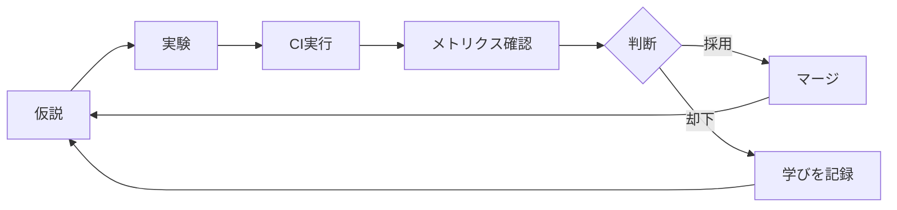

# 第7回 National Medical AI Competition

**並列実験 × 自動評価 × 知見蓄積** が自律的に回る実験基盤

---

## 🎯 目的

このリポジトリは「コードを書くこと」が目的ではない。
**実験 → 評価 → 改善 のサイクルが止まらず回り続けること** が目的である。

---

## 📁 ディレクトリ構造

```
repo-root/
├─ docs/                    # ドキュメント
│  ├─ competition/          # コンペ概要（事実のみ）
│  ├─ planning/             # 計画・戦略
│  └─ workflow/             # 運用ワークフロー
├─ experiments/             # 実験管理（1実験=1ディレクトリ）
├─ scripts/                 # 自動化スクリプト
├─ .github/                 # CI/CD設定
├─ src/                     # ソースコード
└─ tests/                   # テスト
```

---

## 🚀 クイックスタート

### 1. 環境構築

```bash
# リポジトリをクローン
git clone <repo-url>
cd <repo-name>

# 依存関係をインストール
pip install -r requirements.txt
```

### 2. 新しい実験を開始

```bash
# Worktreeを作成
./scripts/create_worktree.sh exp_002_augment

# 作業ディレクトリに移動
cd ../exp_002_augment

# 1. hypothesis.md に仮説を記載
# 2. コードを変更
# 3. ローカルテスト
./scripts/run_tests_local.sh

# 4. プッシュしてPR作成
git add .
git commit -m "exp_002: Add data augmentation"
git push origin exp_002_augment
```

### 3. CI結果を確認

```bash
# CI artifactからmetrics.jsonをダウンロード
gh run download <run-id> -n metrics

# 結果レポートを生成
python scripts/collect_ci_results.py exp_002_augment
```

---

## 📋 実験ワークフロー



### 厳格ルール

1. ✅ すべての実験は「仮説」から始まる
2. ✅ 1実験 = 1仮説
3. ✅ CI結果を見るまで判断しない
4. ✅ 結果は必ず記録する
5. ❌ 仮説なき変更は禁止
6. ❌ 記録なき実験は「やっていない」と同義

---

## 📊 評価指標

| 指標 | 目標値 | 解釈 |
|------|--------|------|
| SSIM | ≥ 0.95 | 構造的類似度 |
| PSNR | ≥ 35 dB | 信号対雑音比 |

---

## 📖 ドキュメント

- [コンペ概要](docs/competition/overview.md) - タスク定義・評価指標
- [マスタープラン](docs/planning/master_plan.md) - 最終ゴール・開発思想
- [マイルストーン](docs/planning/milestones.md) - Phase別目標
- [メトリクス解釈](docs/planning/metrics.md) - 判断基準
- [Worktree運用](docs/workflow/git-worktree-and-ci.md) - 並列実験ワークフロー
- [実験管理](experiments/README.md) - 実験ルール

---

## 🎮 Kaggle GPU訓練

GPUが必要な訓練はKaggleで実行できます。

### セットアップ

1. **Kaggle APIトークンを取得**
   - [Kaggle Settings](https://www.kaggle.com/settings/account) → API → "Create New Token"
   - `kaggle.json`がダウンロードされる

2. **GitHub Secretsに登録**
   - Repository → Settings → Secrets and variables → Actions
   - `KAGGLE_USERNAME`: Kaggleユーザー名
   - `KAGGLE_KEY`: APIキー

### 使い方

**手動実行（GitHub Actions）:**
1. Actions → "Train on Kaggle" → "Run workflow"
2. パラメータを設定して実行
3. 完了後、metricsがPRにコメントされる

**自動実行:**
- `experiment/**`ブランチにpushすると自動で訓練開始

**ローカルから実行:**
```bash
python scripts/trigger_kaggle_training.py --username YOUR_USERNAME
```

---

## 🛠️ スクリプト

| スクリプト | 用途 |
|-----------|------|
| `scripts/create_worktree.sh` | 実験用Worktree作成 |
| `scripts/remove_worktree.sh` | Worktree削除 |
| `scripts/run_tests_local.sh` | ローカルテスト実行 |
| `scripts/collect_ci_results.py` | CI結果収集・レポート生成 |
| `scripts/trigger_kaggle_training.py` | Kaggle訓練トリガー |

---

## 📝 ライセンス

MIT License
