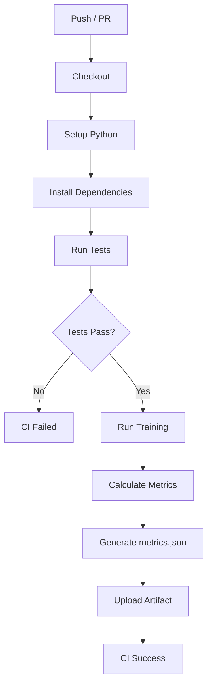

# Git Worktree & CI ワークフロー

## 概要

並列実験を効率的に行うため、**git worktree** を活用する。
各実験は独立したworktreeで行い、mainブランチを汚さない。

---

## Worktree運用ルール

### 基本原則

1. **1実験 = 1 worktree = 1 ブランチ**
2. worktreeの命名: `exp_XXX_description`
3. mainブランチでの直接開発は **禁止**

### ディレクトリ配置

```
parent-dir/
├─ main-repo/          # メインリポジトリ (mainブランチ)
├─ exp_001_baseline/   # 実験用worktree
├─ exp_002_augment/    # 実験用worktree
└─ exp_003_unet/       # 実験用worktree
```

---

## ワークフロー手順

### 1. 実験開始

```bash
# scripts/create_worktree.sh を使用
./scripts/create_worktree.sh exp_002_augment
```

実行される処理:
1. 新しいブランチ `exp_002_augment` を作成
2. 親ディレクトリにworktreeを作成
3. `experiments/exp_002_augment/` ディレクトリを作成
4. `hypothesis.md` テンプレートを配置

### 2. 実験実施

```bash
cd ../exp_002_augment

# コード変更
# hypothesis.md に仮説を記載
# config.yaml に設定を記載

# ローカルテスト
./scripts/run_tests_local.sh

# コミット & プッシュ
git add .
git commit -m "exp_002: Add data augmentation"
git push origin exp_002_augment
```

### 3. CI実行 & 結果確認

1. GitHub上でPRを作成
2. CIが自動実行
3. `metrics.json` がartifactとして保存
4. CI結果を確認

### 4. 結果記録

```bash
# CI結果を収集
python scripts/collect_ci_results.py exp_002_augment

# result.md を記載
# experiments/exp_002_augment/result.md
```

### 5. 判断 & マージ

**採用の場合**:
```bash
# PRをマージ
# mainブランチに変更が取り込まれる
```

**却下の場合**:
```bash
# PRをクローズ
# result.md に却下理由を記録
```

### 6. Worktree削除

```bash
# scripts/remove_worktree.sh を使用
./scripts/remove_worktree.sh exp_002_augment
```

---

## CI パイプライン詳細

### 実行フロー



### CI結果の解釈

| CI Status | 意味 | 次のアクション |
|-----------|------|----------------|
| ✅ Pass | テスト通過 & メトリクス算出完了 | result.md を記載し判断 |
| ❌ Fail (test) | テスト失敗 | コード修正 |
| ❌ Fail (train) | 訓練失敗 | ログ確認 & 修正 |
| ❌ Fail (timeout) | タイムアウト | 計算量削減 |

---

## 並列実験の管理

### 同時実行可能数

- ローカルGPU: 1実験/GPU
- GitHub Actions: 制限なし（ただし課金に注意）

### 実験の優先順位

1. **ベースライン確立**: 最優先
2. **有望な仮説**: 過去の結果から期待値が高いもの
3. **探索的実験**: 新しいアイデアの検証

### コンフリクト回避

- 各実験は独立したブランチで作業
- `src/` の大規模変更は事前に調整
- 共通コードの変更は別PRで先にマージ

---

## トラブルシューティング

### Worktree作成失敗

```bash
# ブランチが既に存在する場合
git branch -D exp_xxx  # ローカルブランチ削除
git push origin --delete exp_xxx  # リモートブランチ削除
```

### CI結果が取得できない

```bash
# GitHub CLI でartifactをダウンロード
gh run download <run-id> -n metrics
```

### Worktree削除後もブランチが残る

```bash
git branch -D exp_xxx
git push origin --delete exp_xxx
```
